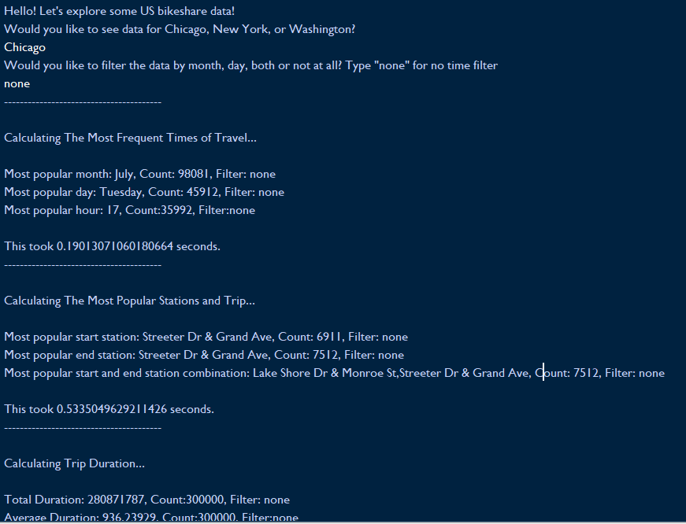

### **Date created**
The project was created on the 03/01/2022

### **Project Title**
Project title is *bikeshare.py*

### **Description**
The project calculates, analyses and displays various statistics based on the user biodata and bike sharing data across three US cities: New York, Chicago and Washington

### **Files used**
*.csv* bikeshare data files used are available upon request

### **Credits**
Some sites were used to gain insight on some sub-problems and python techinques. They are:

https://www.width.ai/pandas/count-specific-value-in-column-with-pandas - __To count specific values in a panda series/data frame__

https://docs.python.org/3/library/calendar.html#calendar.month_name - __To return a list of months or days__

https://blog.finxter.com/how-to-print-a-dictionary-without-brackets-in-python/- __To print a dictionary without brackets__
